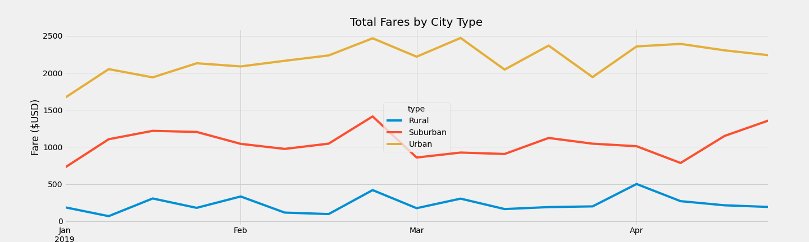

# PyBer Analysis
Exploratory analysis for PyBer, a ride-sharing company, on large sets (2000+ rows) of data
  

## Overview
This review provides visualizations and analysis to improve access to ride-sharing services and accessibility for underserved communities.  
Included are total weekly fares by city type between January and April 2019.

### Resources & Languages
Python, Pandas, Matplotlib, Jupyter Notebook

 

## Results

### City-based Analysis
- Rural cities have the fewest total rides and total drivers, and the lowest total fares, followed by Suburban and Urban.
- Rural cities have the highest average fares per ride and per driver, followed by Suburban and Urban.

 
Fig. 1  

  

### Time-based Analysis
The data shows that fare prices in urban cities are increasing through the year.

The data also shows that fares in rural cities are the most stable. 
There are more consistent, but smaller shifts in pricing, where the urban fares show larger changes throughout each month.

 
Fig. 2  

  

## Summary
 

We recommend that PyBer looks into setting fare limits on rural, and to some extent, suburban pricing to allow those in these underserved communities better access.  
Due to the geographical constrictions, these groups will have longer trips on average, which can drive up prices per ride.
  

Increasing the number of drivers in rural areas will lower the prices due to the dynamic pricing setup used at PyBer.  
Instating a program to encourage urban or suburban drivers to accept rural rides will increase their individual income to offset the costs of travel to rural areas.
  

We encourage the creation of an advertising campaign explaining the new changes made.  
This information, combined with a culturally appropriate atmosphere, may encourage ridership from rural communities, which will in turn lead to more profit from drivers changing location.
  
